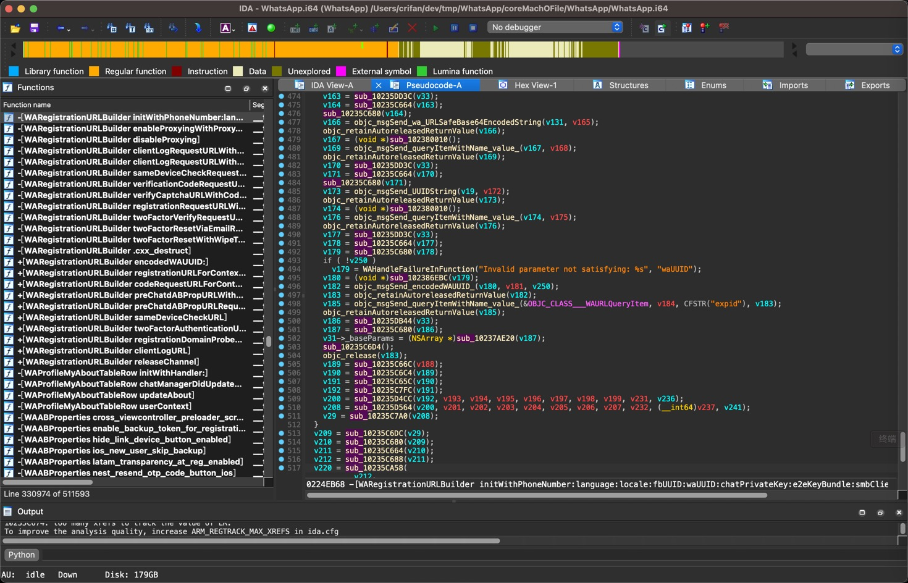
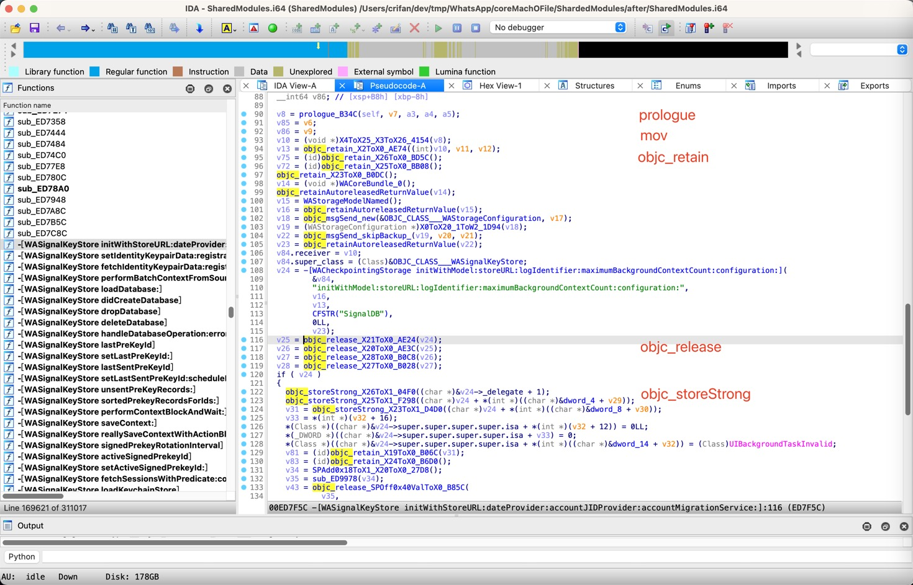

# AutoRename

IDA plugin for auto rename for symbol (and change function type, find objc_msgSend class name, add function comment)

## Git Repo

https://github.com/crifan/AutoRename

https://github.com/crifan/AutoRename.git

## Background

when iOS reverse, using IDA pseudocode to anlysis function logic, but too many `sub_XXX` default name functions.

while many of them are simple function:

* only few instructions
* and match simple logic
  * for exmaple
    * all `MOV` then end with `RET`
    * all `MOV` then end with `B`
    * all `STP` then end with `RET` = I called it `prologue` function
    * ....

previsouly, need manual to rename to reflect it content, such as

```bash
__text:00000001023A2534 sub_1023A2534
__text:00000001023A2534                 MOV             X5, X0
__text:00000001023A2538                 MOV             X0, X19
__text:00000001023A253C                 RET
```

rename from `sub_1023A2534` to `X0toX5_X19toX0_2534`

here try use (IDA Plugin) python code to automate whole rename process, to facilitate iOS reverse

## Example

* Effect Compare
  * before
    * 
  * after
    * 

### Rename

#### AllMovThenRet

##### sub_10235F998 -> `X24toX0_X23toX2_F998`

```bash
__text:000000010235F998 X24toX0_X23toX2_F998
__text:000000010235F998                 MOV             X0, X24
__text:000000010235F99C                 MOV             X2, X23
__text:000000010235F9A0                 RET
```

##### sub_10235F980 -> `func_0toX3_0toX4_X20toX5_F980`

```bash
__text:000000010235F980 func_0toX3_0toX4_X20toX5_F980
__text:000000010235F980                 MOV             X3, #0
__text:000000010235F984                 MOV             X4, #0
__text:000000010235F988                 MOV             X5, X20
__text:000000010235F98C                 RET
```

##### sub_10001CBA8 -> `X20toX0_0x30toW1_0x7toW2_CBA8`

```bash
__text:000000010001CBA8 X20toX0_0x30toW1_0x7toW2_CBA8
__text:000000010001CBA8                 MOV             X0, X20
__text:000000010001CBAC                 MOV             W1, #0x30 ; '0'
__text:000000010001CBB0                 MOV             W2, #7
__text:000000010001CBB4                 RET
```

#### AllMovThenBranch

##### sub_10235D56C -> `objc_msgSend$addObject_X22toX2_D56C`

```bash
__text:000000010235D56C objc_msgSend$addObject_X22toX2_D56C
__text:000000010235D56C                 MOV             X2, X22 ; object
__text:000000010235D570                 B               _objc_msgSend$addObject__AB00
```

##### sub_F0AEB0 -> `WAXIncomingStanzaError_4toW0_X21toX1_X22toX3_X20toX4_AEB0`

```bash
__text:0000000000F0AEB0 WAXIncomingStanzaError_4toW0_X21toX1_X22toX3_X20toX4_AEB0
__text:0000000000F0AEB0                 MOV             W0, #4
__text:0000000000F0AEB4                 MOV             X1, X21
__text:0000000000F0AEB8                 MOV             X3, X22
__text:0000000000F0AEBC                 MOV             X4, X20
__text:0000000000F0AEC0                 B               _WAXIncomingStanzaError
```

#### prologue

##### sub_10235D3C0 -> `prologue_10235D3C0`

```bash
__text:000000010235D3C0 sub_10235D3C0
__text:000000010235D3C0                 STP             X28, X27, [SP,#arg_70]
__text:000000010235D3C4                 STP             X26, X25, [SP,#arg_80]
__text:000000010235D3C8                 STP             X24, X23, [SP,#arg_90]
__text:000000010235D3CC                 STP             X22, X21, [SP,#arg_A0]
__text:000000010235D3D0                 STP             X20, X19, [SP,#arg_B0]
__text:000000010235D3D4                 RET
```

### change type (or add function comment)

Note: only for `objc_msgSend`

#### only change function type

##### normal case

* case 1

`id(void *, const char *, ...)` -> `id objc_msgSend_updateWithProperties_samplingWeights_protocolVersion_configKey_configHash_refreshInterval_refreshID_(id curObj, const char *updateWithProperties_samplingWeights_protocolVersion_configKey_configHash_refreshInterval_refreshID_, id someProperties, id samplingWeights, id protocolVersion, id configKey, id configHash, id refreshInterval, id refreshID)`


```asm
__objc_stubs:00000001027A89C0 ; =============== S U B R O U T I N E =======================================
__objc_stubs:00000001027A89C0
__objc_stubs:00000001027A89C0
__objc_stubs:00000001027A89C0 ; id __cdecl objc_msgSend_updateWithProperties_samplingWeights_protocolVersion_configKey_configHash_refreshInterval_refreshID_(id curObj, const char *updateWithProperties_samplingWeights_protocolVersion_configKey_configHash_refreshInterval_refreshID_, id someProperties, id samplingWeights, id protocolVersion, id configKey, id configHash, id refreshInterval, id refreshID)
__objc_stubs:00000001027A89C0 _objc_msgSend$updateWithProperties_samplingWeights_protocolVersion_configKey_configHash_refreshInterval_refreshID_
__objc_stubs:00000001027A89C0                                         ; CODE XREF: sub_101C7DCB4+FC↑p
__objc_stubs:00000001027A89C0                                         ; -[WARootViewController updateOfflineAssignABProperties]+E8↑p
__objc_stubs:00000001027A89C0                 ADRP            X1, #selRef_updateWithProperties_samplingWeights_protocolVersion_configKey_configHash_refreshInterval_refreshID_@PAGE
__objc_stubs:00000001027A89C4                 LDR             X1, [X1,#selRef_updateWithProperties_samplingWeights_protocolVersion_configKey_configHash_refreshInterval_refreshID_@PAGEOFF]
__objc_stubs:00000001027A89C8                 ADRP            X16, #_objc_msgSend_ptr@PAGE
__objc_stubs:00000001027A89CC                 LDR             X16, [X16,#_objc_msgSend_ptr@PAGEOFF]
__objc_stubs:00000001027A89D0                 BR              X16
__objc_stubs:00000001027A89D0 ; End of function _objc_msgSend$updateWithProperties_samplingWeights_protocolVersion_configKey_configHash_refreshInterval_refreshID_
```

==

```c
id __cdecl objc_msgSend_updateWithProperties_samplingWeights_protocolVersion_configKey_configHash_refreshInterval_refreshID_(
        id curObj,
        const char *updateWithProperties_samplingWeights_protocolVersion_configKey_configHash_refreshInterval_refreshID_,
        id someProperties,
        id samplingWeights,
        id protocolVersion,
        id configKey,
        id configHash,
        id refreshInterval,
        id refreshID)
{
  return _objc_msgSend(
           curObj,
           "updateWithProperties:samplingWeights:protocolVersion:configKey:configHash:refreshInterval:refreshID:",
           someProperties,
           samplingWeights,
           protocolVersion,
           configKey,
           configHash,
           refreshInterval);
}
```

* case 2

```c
id __cdecl objc_msgSend_xmppStreamDidNotAuthenticate_dataCenter_failureCode_lockDuration_retryAfter_tempBanReasonCode_tempBanURL_tempBanMessage_violationType_banAppealsToken_logoutMessageHeader_logoutMessageSubtext_logoutMessageLocale_violationReason_sourceAccount_(
        XMPPConnection *curXMPPConnection,
        const char *xmppStreamDidNotAuthenticate_dataCenter_failureCode_lockDuration_retryAfter_tempBanReasonCode_tempBanURL_tempBanMessage_violationType_banAppealsToken_logoutMessageHeader_logoutMessageSubtext_logoutMessageLocale_violationReason_sourceAccount_,
        id xmppStreamDidNotAuthenticate,
        id dataCenter,
        id failureCode,
        id lockDuration,
        id retryAfter,
        id tempBanReasonCode,
        id tempBanURL,
        id tempBanMessage,
        id violationType,
        id banAppealsToken,
        id logoutMessageHeader,
        id logoutMessageSubtext,
        id logoutMessageLocale,
        id violationReason,
        id sourceAccount)
{
  return -[XMPPConnection xmppStreamDidNotAuthenticate:dataCenter:failureCode:lockDuration:retryAfter:tempBanReasonCode:tempBanURL:tempBanMessage:violationType:banAppealsToken:logoutMessageHeader:logoutMessageSubtext:logoutMessageLocale:violationReason:sourceAccount:](
           curXMPPConnection,
           "xmppStreamDidNotAuthenticate:dataCenter:failureCode:lockDuration:retryAfter:tempBanReasonCode:tempBanURL:temp"
           "BanMessage:violationType:banAppealsToken:logoutMessageHeader:logoutMessageSubtext:logoutMessageLocale:violati"
           "onReason:sourceAccount:",
           xmppStreamDidNotAuthenticate,
           dataCenter,
           failureCode,
           lockDuration,
           retryAfter,
           tempBanReasonCode);
}
```

* for capable to find class name 
  * single class name: change id type
  * <= 5 class name: add to function comment

eg:

##### change id type

```c
id __cdecl objc_msgSend_zoomToUserLocationAnimated_resetZoomLevel_(
        WAMapView *curWAMapView,
        const char *zoomToUserLocationAnimated_resetZoomLevel_,
        id zoomToUserLocationAnimated,
        id resetZoomLevel)
{
  return -[WAMapView zoomToUserLocationAnimated:resetZoomLevel:](
           curWAMapView,
           "zoomToUserLocationAnimated:resetZoomLevel:",
           zoomToUserLocationAnimated,
           resetZoomLevel);
}
```

in which, change id type (and name) from `id curObj` to ` WAMapView *curWAMapView`

##### add to function comment

```c
// -[WACallManager endCallWithReason:], -[WACallManagerBase endCallWithReason:]
id __cdecl objc_msgSend_endCallWithReason_(id curObj, const char *endCallWithReason_, id someReason)
{
  return _objc_msgSend(curObj, "endCallWithReason:", someReason);
}
```

in which, added function comment `-[WACallManager endCallWithReason:], -[WACallManagerBase endCallWithReason:]`

## TODO

* [x] support `FMOV`
* [x] support `prologue`
* [x] support `objs_msgSend` change type
* [x] support all `Functions`
* [ ] add example screenshot: before and after compare effect
* [ ] support all `Names`
